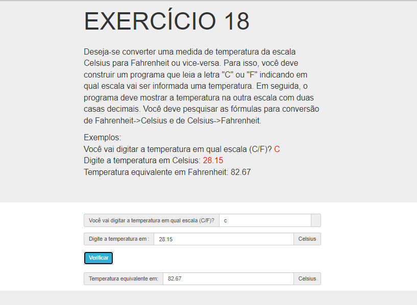

# Jovens Tegranos Exercicio 18

# 🏁 **Tópicos**

 * 👉 Banner
 * 👉 Título e Descrição
 * 👉 Status do Projeto
 * 👉 Funcionalidades
 * 👉 Demonstração da aplicação
 * 👉 Pré-requisitos
 * 👉 Tecnologias utilizadas
 * 👉 Autor
 * 👉 Licença
 
 ____________________________________________________________
# ✅ Banner 👌

<h1 align="center">
  
</h1>

# ✅ Título e Descrição 👌

### Exercicio 18

#### Deseja-se converter uma medida de temperatura da escala Celsius para Fahrenheit ou vice-versa. Para isso, você deve construir um programa que leia a letra "C" ou "F" indicando em qual escala vai ser informada uma temperatura. Em seguida, o programa deve mostrar a temperatura na outra escala com duas casas decimais. Você deve pesquisar as fórmulas para conversão de Fahrenheit->Celsius e de Celsius->Fahrenheit.

    Exemplos:
    Você vai digitar a temperatura em qual escala (C/F)? C
    Digite a temperatura em Celsius: 28.15
    Temperatura equivalente em Fahrenheit: 82.67

    Você vai digitar a temperatura em qual escala (C/F)? F
    Digite a temperatura em Fahrenheit: 75.00
    Temperatura equivalente em Celsius: 23.89
       

# ✅ Status do Projeto 👌

### 🚧 Projeto 🚀 **Concluído com Sucesso!!!** 👌 🚧

# ✅ Funcionalidades 👌

### - [x] Converter uma medida de temperatura da escala Celsius para Fahrenheit ou vice-versa.
### - [x] Leia a letra "C" ou "F" indicando em qual escala vai ser informada uma temperatura.
### - [x] Mostrar a temperatura na outra escala com duas casas decimais.

# ✅ Demonstração da aplicação 👌

<h1 align="center">
  
</h1>

### GitHub AlineAlmeida85

### Link: [Projeto](https://alinealmeida85.github.io/Jovens-Tegranos-Exercicio18/)

# ✅ Pré-requisitos 👌

### Nenhum, basta clicar no link acima

# ✅ Tecnologias utilizadas ⚒️ 👌

### As seguintes tecnologias foram usadas na construção do projeto:

- [HTML](https://pt.wikipedia.org/wiki/HTML)
- [CSS](https://pt.wikipedia.org/wiki/Cascading_Style_Sheets)
- [JavaScript](https://www.javascript.com/)
- [Lógica de Programação]()

# ✅ Autor 👌

### Aline Almeida 💝

# ✅ Licença

### Não Possui

#### Espero que te agrade! ❤️

